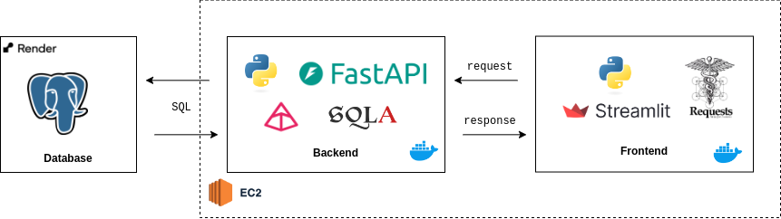

# User Management System (UMS)

## Table of Contents
- [Introduction](#introduction)
- [Features](#features)
- [Running the Application](#running-the-application)
- [Technologies Used](#technologies-used)
- [License](#license)

## Introduction
The User Management System (UMS) is a web application designed to manage users in a simple and user-friendly way. The application provides all the main functions: registering, updating, and consulting users.


## Features
- User registration
- Updating user registration data
- Consultation of all registered users
- Individual user consultation
- Removing users

## Running the Application
To get started with the UMS, follow these steps:

1. Clone the repository:
   ```bash
   git clone https://github.com/your-username/users-management.git
   ```
2. Navigate to the project directory
    ```bash
    cd users-management
    ```
3. Set up the environment variables: Create a .env file in the root directory and add the following variables:
    ```
    DB_HOSTNAME=your_db_hostname
    DB_USER=your_db_user
    DB_PASSWORD=your_db_password
    DB_DATABASE=your_db_name
    ```

4. Using Docker Compose:
    ```bash
    docker-compose up --build
    ```

## Technologies Used



## License
This project is licensed under the MIT License. See the LICENSE file for more details.